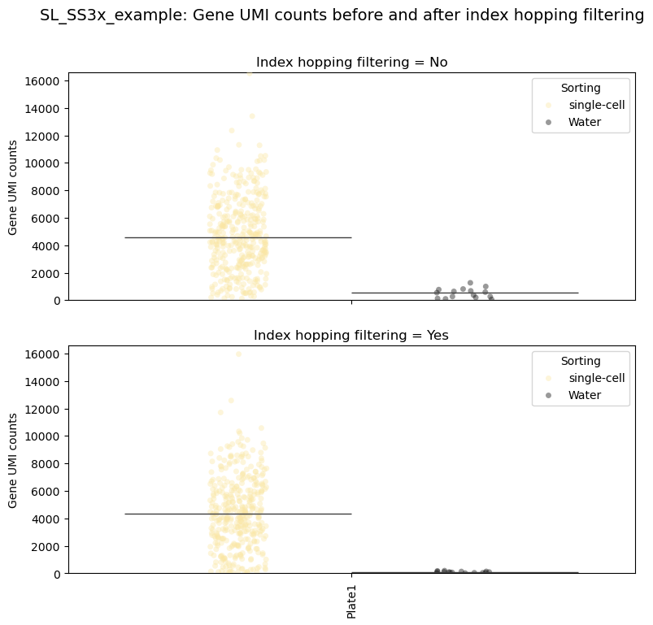

## Example analysis pipeline for data derived from a SL-SS3xpress scRNA-seq experiment
### Git clone this repository
```
git clone https://github.com/Siegel-Lab/SL-SS3x-protocol.git
cd SL-SS3x-protocol
```

### Create and activate conda environment
```
conda env create -f SL_SS3xpress_env.yaml
conda activate SL_SS3xpress_env
```

### Download example data
```
mkdir -p input/reads

# download the example SL_SS3xpress data

wget -c -O input/reads/example_R1.fastq.gz ftp://ftp.sra.ebi.ac.uk/vol1/run/ERR127/ERR12711090/SS3x_003_filtered_lane1_R1.fixed.fastq.gz
wget -c -O input/reads/example_R2.fastq.gz ftp://ftp.sra.ebi.ac.uk/vol1/run/ERR127/ERR12711090/SS3x_003_filtered_lane1_R4.fixed.fastq.gz
wget -c -O input/reads/example_i7.fastq.gz ftp://ftp.sra.ebi.ac.uk/vol1/run/ERR127/ERR12711091/SS3x_003_filtered_lane1_R2.fixed.fastq.gz
wget -c -O input/reads/example_i5.fastq.gz ftp://ftp.sra.ebi.ac.uk/vol1/run/ERR127/ERR12711091/SS3x_003_filtered_lane1_R3.fixed.fastq.gz

```

### Run the preprocessing script
```
sbatch run.sh

# OR (without SLURM job scheduling)

bash run.sh

```
### After the preprocessing is complete, launch JupyterLab:
```
jupyter-lab

```
In the JupyterLab interface, open:

```
SL_Smart-seq3xpress_protocol_downstream_pipeline.ipynb

```

Follow the notebook cells step-by-step to generate analysis results and plots.

### Example output plot


